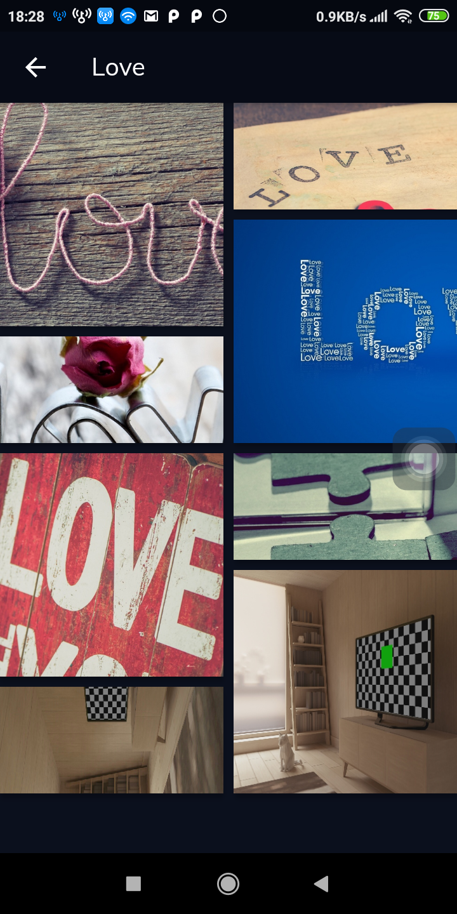
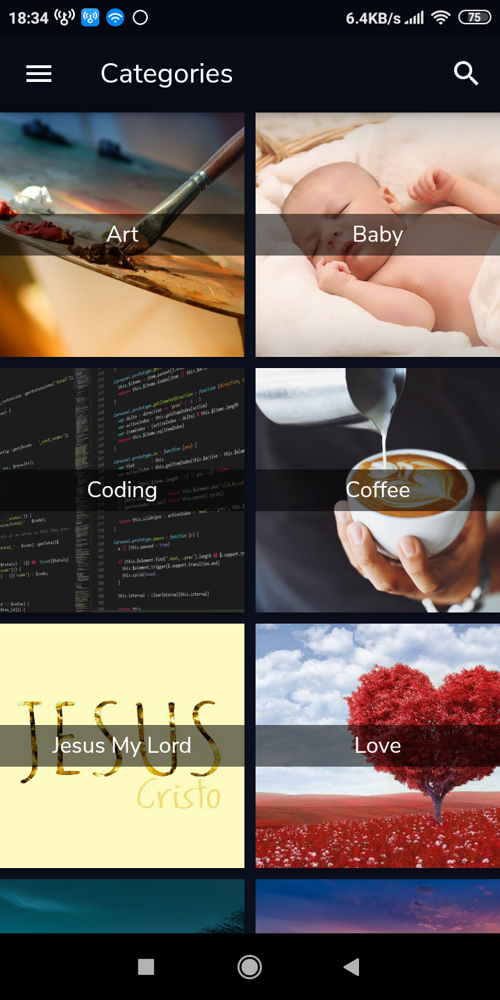
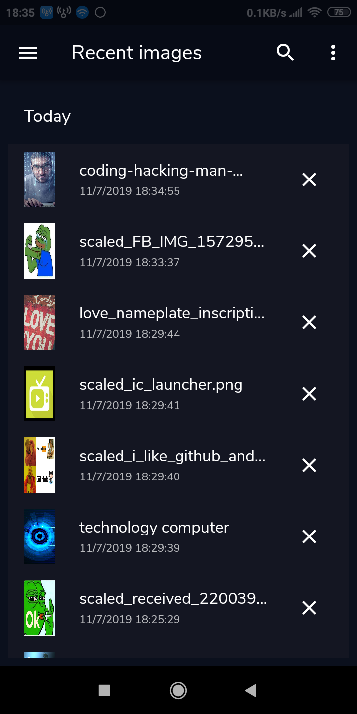
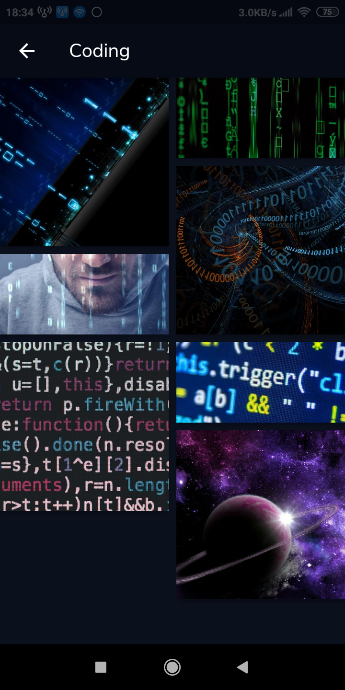

# wallpaper-flutter

 - Simple wallpaper flutter

 - This is a very simple app created for the begginers.

 - Flutter + Method channel (Kotlin/Swift)

# Screenshots

|                                     |                                     |                                     |                               |
|                    :---:            |                :---:                |                   :---:             |                :---:          |
|  |  |  |  |
|  |  |  |  |
|  |  |  | |
 
# Getting Started

For help getting started with Flutter, view our online
[documentation](https://flutter.io/).
 
# Develop

Make sure finish [install Flutter](https://flutter.io/get-started/install/) successfully

1. Clone this repo by: `git clone https://github.com/hoc081098/wallpaper-flutter.git`
2. Install all the packages by: `flutter packages get`
3. Run app on your simulator by: `flutter run`

# Packages in using
* cloud_firestore
* flutter_staggered_grid_view
* image_picker
* path_provider
* permission_handler
* sqflite
* firebase_storage
* uuid
* rxdart
* intl
* http
* cached_network_image
* pedantic
* tuple
